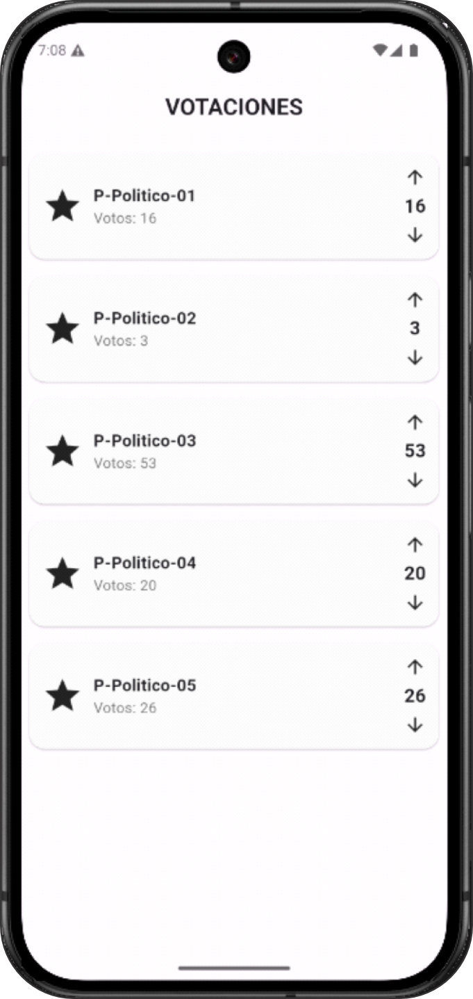

# 🗳️ App de Votaciones con Flutter + Firebase Firestore


Una aplicación **real‑time** para votar por partidos políticos, construida con **Flutter** y **Firebase Firestore** usando **Streams**.  
Actualiza los votos instantáneamente y muestra una UI limpia, rápida y responsive.

---

## 📸 Vista Previa

<p align="center">
  
  

</p>

---

## 🧭 Tabla de Contenido
- [Características](#-características)
- [Arquitectura](#-arquitectura)
- [Estructura del Proyecto](#-estructura-del-proyecto)
- [Modelo de Datos](#-modelo-de-datos)
- [Reglas de Seguridad de Firestore](#-reglas-de-seguridad-de-firestore)
- [Configuración Rápida](#-configuración-rápida)
- [Scripts Útiles](#-scripts-útiles)
- [Roadmap](#-roadmap)
- [Contribuir](#-contribuir)
- [Créditos](#-créditos)
- [Licencia](#-licencia)

---

## ✨ Características
- 🔁 **Actualización en tiempo real** usando `StreamBuilder` + `Firestore`.
- ⬆️⬇️ **Votación** (incrementar/decrementar) con transacciones seguras.
- 🧱 **Modelo tipado** en Dart (`Partido`) y mapeo desde Firestore.
- 🎨 **UI** limpia con `Material 3` y diseño responsive.
- ☁️ **Firebase** listo para producción (reglas y seeding opcional).

---

## 🏗️ Arquitectura
- **UI**: `votaciones_page.dart` (lista de partidos, botones de voto, stream).
- **Servicio**: `firestore_service.dart` (lectura y transacciones).
- **Modelo**: `partido_model.dart` (DTO + `fromMap()` / `toMap()`).
- **Bootstrap**: `main.dart` (inicializa Firebase y lanza la app).

**Diagrama simple:**

```
Flutter Widgets (StreamBuilder, ListView, Cards)
        │
        ▼
FirestoreService ── (getPartidos, votar) ──► Firebase Firestore (colección: partidos)
        ▲
        │
   Partido (modelo)
```

---

## 🗂️ Estructura del Proyecto

```
lib/
├─ main.dart
├─ models/
│  └─ partido_model.dart
├─ pages/
│  └─ votaciones_page.dart
└─ services/
   └─ firestore_service.dart

assets/
└─ screenshots/
   ├─ screen_01.png   
```

---

## 🧾 Modelo de Datos

**Colección:** `partidos`  
**Documento (ejemplo):**
```json
{
  "nombre": "P-Politico-01",
  "votos": 17
}
```

**Dart (`partido_model.dart`):**
```dart
class Partido {
  final String id;
  final String nombre;
  final int votos;

  Partido({required this.id, required this.nombre, required this.votos});

  factory Partido.fromMap(Map<String, dynamic> data, String documentId) {
    return Partido(
      id: documentId,
      nombre: data['nombre'] ?? '',
      votos: data['votos'] ?? 0,
    );
  }

  Map<String, dynamic> toMap() {
    return {'nombre': nombre, 'votos': votos};
  }
}
```

---

## 🔒 Reglas de Seguridad de Firestore

> Ajusta según tus necesidades y **restringe** acceso en producción.

```javascript
rules_version = '2';
service cloud.firestore {
  match /databases/{database}/documents {
    match /partidos/{partidoId} {
      allow read: if true; // público (solo lectura)
      allow write: if request.auth != null; // requiere usuario autenticado
    }
  }
}
```

---

## ⚙️ Configuración Rápida

1) **Clona** el repo y entra al proyecto
```bash
git clone https://github.com/tu-usuario/app-votaciones-flutter.git
cd app-votaciones-flutter
```

2) **Instala dependencias**
```bash
flutter pub get
```

3) **Configura Firebase**
- Crea un proyecto en Firebase Console.
- Agrega una app **Android** (y/o iOS) y descarga `google-services.json` en `android/app/` (y `GoogleService-Info.plist` en iOS).
- Habilita **Cloud Firestore**.
- (Opcional) Habilita **Authentication** si deseas restringir votos a usuarios logueados.

4) **Ejecuta**
```bash
flutter run
```

---

## 🧰 Scripts Útiles

**Seeding inicial (Node.js con firebase-admin):**
```js
const admin = require('firebase-admin');
admin.initializeApp();
const db = admin.firestore();

const partidos = [
  { nombre: 'P-Politico-01', votos: 17 },
  { nombre: 'P-Politico-02', votos: 12 },
  { nombre: 'P-Politico-03', votos: 5  },
  { nombre: 'P-Politico-04', votos: 9  },
  { nombre: 'P-Politico-05', votos: 3  },
];

(async () => {
  const batch = db.batch();
  partidos.forEach(p => batch.set(db.collection('partidos').doc(), p));
  await batch.commit();
  console.log('Seed completo ✅');
})();
```

---

## 🗺️ Roadmap
- [ ] Autenticación con Firebase Auth (Google / Email).
- [ ] Historial de votos por usuario.
- [ ] Gráfico en tiempo real (bar chart / pie).
- [ ] Modo oscuro/sistema de temas.
- [ ] Tests unitarios y de integración (Widget Tests).

---

## 🤝 Contribuir
¡Se aceptan PRs!  
1. Crea un branch: `feat/tu-feature`  
2. Asegura formato: `dart format .`  
3. Corre análisis estático: `flutter analyze`  
4. Haz PR con descripción y capturas si aplica.

---

## 👏 Créditos
**Autor:** SUAREZ RAMOS, Elvis Belisario  
**Curso:** Desarrollo de Apliciones Móviles – Código by TECSUP  
**Docente:** Jhonny Frans Gallegos  
**Año:** 2025

---

## 📄 Licencia
Este proyecto está bajo la licencia **MIT**. Consulta el archivo [`LICENSE`](LICENSE) para más información.
